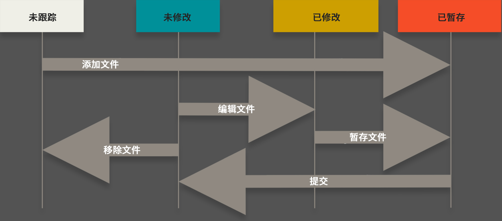
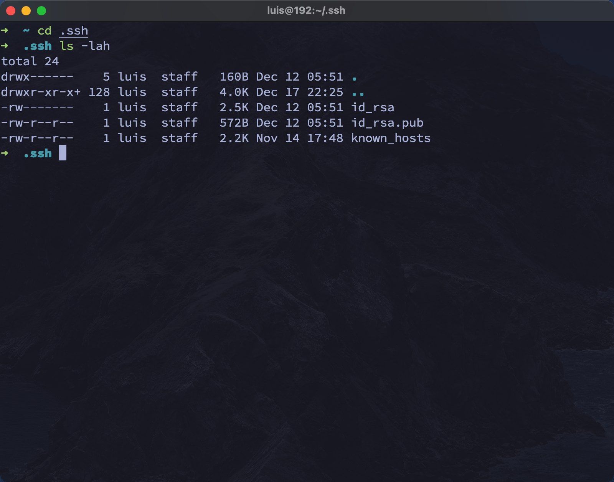
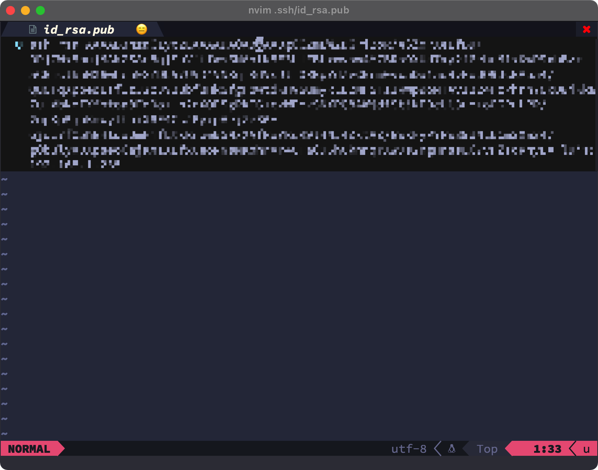
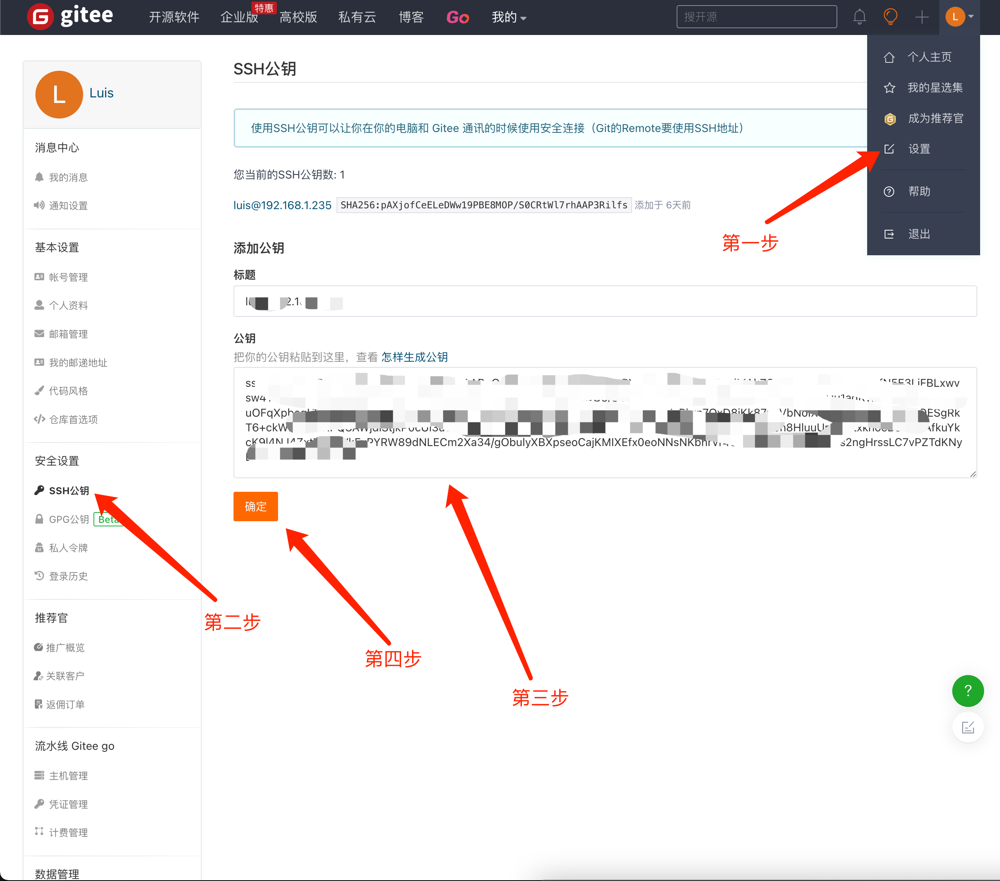

# git 教程

## 名词概念

### 📝 workspace 工作区

需要提交文件的根目录, 也就是工程文件所在的目录,除了 .git 目录, 因为 .git 目录是git 的配置文件目录

就像你的草稿纸或文档编辑器（比如 Word），你在上面写字、修改内容，但这些改动只是暂时的，还没有正式保存。

### 📌 staging area 暂存区

提交到仓库之前的再存区域。当你觉得文件已经编辑完成要提交老师了，要把完成的文件暂时存放在一个区域。这个区域就是暂存区。此时文件的状态被跟踪状态, 被跟踪的文件已经被作为单独的副本保存在暂存区, 如果工作区的文件被修改,暂存区的文件并不会受到影响。

> **注**: 修改或添加的文件不要轻易提交仓库，如果随便提交会导致版本冗余，增加仓库大小，而 `github` 、`gitee` 等远程仓库的存储容量是有限的，无意义的提交只会占用远程仓库空间，为了避免这个问题，添加或修改的文件可以放在暂存区，确定暂无修改了，再进行统一提交。

### 📂 local repository 本地仓库

你觉得文件已经有一定的完成度了，于是正式存档在自己的专门的区域，也就是准备正式将文件保存到专门存放已完成文件的区域。就像你整个文件/文件夹备份了一份，确保不会丢失。

### ☁️r emote repository 远程仓库

相当于将已完成的文件上传到网盘，以便分享和备份

**总结**：

 - 工作区 = 你正在编辑的文件
 - 暂存区 = 你选出来准备提交的文件
 - 本地仓库 = 你誊写并存档的最终版本
 - 远程仓库 = 你上传到云端共享的版本

*git 流程图* 



## 初始化配置

### git config 配置工具

用户设置和一些额外配置。配置的参数如有空格，则使用双引号 `"` 包含起来

| 选项                  | 说明                                                                                                |
|-----------------------|-----------------------------------------------------------------------------------------------------|
| ===================== | ===                                                                                                 |
| `--global`            | 代表用户的全局设置,设置只对当前用户生效,配置文件位于 `~/.gitconfig`)                                |
| `--system`            | 代表系统级设置,设置对所有用户生效,配置文件位于`/etc/gitconfig`                                      |
| `--local`             | 代表仓库设置,配置文件位于 `当前仓库/.git/config`                                                    |
| `-l`(`--list`)        | 查看配置文件内容, 用户配置+项目配置+系统配置的总览                                                  |
| `-e`(`--edit`)        | 单独的 `-e` 参数表示编辑当前项目配置文件,等同于 `-e --local`,相当于编辑 `当前仓库/.git/config` 文件 |
| `-e --global`         | 编辑用户配置文件,相当于编辑 `~/.gitconfig` 文件                                                     |
| `-e --system`         | 编辑系统配置文件, 相当于编辑 `/etc/gitconfig` 文件                                                  |
| `--get`               | 获取 Git 配置项的值                                                                                 |
| `--unset`             | 移除 Git 配置项                                                                                     |
| `--unset-all`         | 移除 Git 所有配置项                                                                                 |

``` sh
# 设置用户名:
git config --global user.name "Luis"

# 查看用户名置:
git config user.name

# 取消用户名置:
git config --unset --global user.name

----------------------------------------------------------------

# 设置用户邮箱:
git config --global user.email "xxxxxxxxx@xx.com"

# 查看用户邮箱置:
git config user.email

# 取消用户邮箱置
git config --unset --global user.email

----------------------------------------------------------------

# 默认分支名为 main
git config --global init.defaultBranch main

----------------------------------------------------------------

# 设置默认编辑器; git 默认编辑器是 vim, 如不喜欢可以改成其他编辑器! 这里用的是 nvim:
git config --global core.editor nvim

# 查看默认编辑器配置:
git config core.editor

# 取消编辑器配置:
git config --unset --global core.editor

----------------------------------------------------------------
# 换行符处理（非常重要）:
# Mac/Linux
git config --global core.autocrlf input

# Windows
git config --global core.autocrlf true

----------------------------------------------------------------

# 不忽略文件名大小写
git config --global core.ignorecase false

----------------------------------------------------------------

# 高亮显示: 
git config --global color.ui true

----------------------------------------------------------------

# 代理配置: 
git config --global http.proxy http://127.0.0.1:7890
git config --global https.proxy http://127.0.0.1:7890

# 取消代理:
git config --global --unset http.proxy 
git config --global --unset https.proxy

----------------------------------------------------------------

# 免密码推送/拉去： 
# 缓存凭证（避免重复输入密码）
git config --global credential.helper store

# 或更安全的：
git config --global credential.helper cache

----------------------------------------------------------------

# 列出配置信息总览:
git config --list
# 可简写成 git config -l

# 查看所有配置(包括配置文件路径):
git config --list --show-origin

----------------------------------------------------------------

# 编辑用户配置文件:
git config --global --edit 
```


### 排除文件

让特定文件/目录不被提交仓库

在工作区新建 `.gitignore` 文件, 打开文件并编辑一下内容

```sh
# 单个文件排除/保留
*.txt   # 忽略以 .txt 为结尾的文件
!lib.txt # 但lib.txt 文件除外
dir1/ # 忽略 dir1 目录及目录下的所有文件
/dir2 # 忽略除 dir2 目录以外的所有文件

# 保留指定多个文件
/* # 先排除当前目录下所有文件和目录
!/1/ # 但保留 1 目录
/1/* # 忽略 1 目录下的所有文件
!/1/a.txt # 但保留 1 目录下的 a.txt 文件
!/1/2/ # 还有保留 1 目录下的 2 目录
```

> **注**:
> 1. ! 用于取消忽略（反选）。
> 2. 忽略规则是相对路径的，从 .gitignore 所在的目录开始匹配。
> 3. .gitignore 只能忽略未被 Git 追踪的文件。
>       - 如果某文件已经被提交到仓库，再添加到 .gitignore 是无效的。
>       - 解决办法：`git rm --cached 文件名`

---

## 仓库操作

### git init 初始化仓库

在指定目录下初始化一个空的 git 本地仓库, 指定的 目录下会自动生成 .git 隐藏文件夹，里面包含了所有 git 的元数据. 该隐藏文件夹就是 git 版本库, 可以理解把指定的目录转换成了本地仓库, 

| 选项                   | 说明|
|-|-|
|`-b`|指定分支名称|
| `--initial-branch=` |指定分支名 功能同 `-b`|


**案例:** 

``` sh
# 初始化仓库, 若已经在该目录下,直接输入 `git init` 即可
git init [dir]

# 初始化仓库，并将默认分支改为 Luis
git init -b luis

# 初始化仓库，并将默认分支改为 Luis
git init --initial-branch=luis
```


---
<br/>

### git clone 克隆远程仓库

将远程仓库里的代码拷贝到本地目录

| 选项        | 说明               |
|-------------|--------------------|
| `--depth 1` | 只克隆当前版本文件 |

``` sh
git clone [url]
```

**克隆到指定目录:**

若没有指定目录, git 会自动创建

``` sh
git clone [url] [dir]
```

---


### git add 添加到暂存区

``` sh
git add [files]
```

**添加所有文件:** 

可用 `git add .` 将所有文件添加到暂存区

| 选项 | 说明                     |
|------|--------------------------|
| `.`  | 表示当前目录下的所有文件 |


### git rm 删除文件

| 选项       | 说明                               |
|------------|------------------------------------|
| `--cached` | 表示暂存区 ,仅删除暂存区跟踪的文件 |
| `-f`       | 强制删除                           |
| `-r`       | 递归删除目录和目录内的文件         |

---

### git commit 上传本地仓库

将暂存区文件提交到本地仓库

``` sh
git commit -m "第一次提交"
```
---

**选项:** 

| 选项 | 说明                           |
|------|--------------------------------|
| `-m` | m 为 message. 添加提交信息说明 |

### git status 查看仓库状态

**查看文件状态:** 

```
git status
```

**输出以下结果:**

``` sh
On branch master
Changes to be committed:
  (use "git restore --staged <file>..." to unstage)
        new file:   1.c

Changes not staged for commit:
  (use "git add <file>..." to update what will be committed)
  (use "git restore <file>..." to discard changes in working directory)
	modified:   2.c

Untracked files:
  (use "git add <file>..." to include in what will be committed)
	3.c

no changes added to commit (use "git add" and/or "git commit -a")
```

**包含的状态:**
1. On branch master: 当前所在的分支。
2. changes to be committed: 待提交的文件(在暂存区未提交到本地仓库)
3. changes not staged for commit: 已修改但未添加到暂存库的文件
	- modified: 已修改的文件
4. untracked files: 没有添加到暂存区的新的文件(未跟踪文件)
5. No commits yet: 暂存区里没有未提交库的文件
6. nothing to commit: 没有任何文件需要提交

---

### git mv 重命名/移动文件

注: 重命名和移动文件之后的状态, 都会保存在暂存区.而不是直接对仓库里的文件进行操作. 重命名或移动文件之后要提交到仓库!!!


**重命名文件:** 

```
git mv [路劲/文件名] [新路径/文件名]
```


**移动文件:** 

``` sh
git mv [文件名] [新文件名]
```
---

### git diff 对比仓库和工作区文件

``` sh
git diff [filename]
```

**输出结果:** 

``` sh
diff --git a/test.txt b/test.txt
index 8bda4cb..3488c68 100644
--- a/test.txt
+++ b/test.txt
@@ -1,4 +1,5 @@
-this is test word
+this is test word hello
+h
 this is test word
 this is test word
 this is test word
```

以上输出结果中, 前面有 `+` 号的代表新增的内容. 前面有 `-` 号的代表去除的内容. 若对其中一行进行修改,输出结果为新增一行,减去一行.

如果修改的文件被跟踪, 再对工作区进行修改, 那么 `git diff ....` 只对比工作区和暂存区的文件.

如果文件在暂存区, 工作区被修改的文件只能和暂存区的文件进行对比, 若文件被提交仓库, 则工作区文件只能和仓库文件进行对比

要对比暂存区和本地库的文件, 要加一个 `--staged` 参数

``` sh
git diff --staged [filename]
```

---


### git reset 版本回退

| 选项      | 说明                                             |
|-----------|--------------------------------------------------|
| `--soft`  | 移动指针到指定版本号, 不更改工作区和暂存区内容   |
| `--mixed` | 默认值,移动指针到指定版本号, 暂存区内容会更改    |
| `--hard`  | 移动指针到指定版本号, 暂存区和工作区内容会被更改 |

**查看历史版本:**

``` sh
git reflog
```

**更改到指定版本:**

``` sh
git reset --hard [版本号] 
```

---

## 日志管理

### git reflog 查看短日志

``` sh
git reflog
```

输出以下结果:

``` sh
daacfa1 (HEAD -> master, origin/master, origin/HEAD) HEAD@{0}: commit: git note
```

`git reflog` 只输出 版本号,所在分支和提交信息

---

### git log 查看查看详细日志

查看提交的账户信息,备注和提交时间

| 参数|说明|
|-|-|
| `--oneline` | 简明显示提交记录（只显示版本号和提交信息）|

``` sh
git log
```

**输出以下结果:**

``` sh
commit e151e9ed9290b8ad32aecb8ccd4bc5b6573a4f1b (HEAD -> master, origin/master, origin/HEAD)
Author: Luis <1014150883@qq.con>
Date:   Mon Dec 12 02:52:26 2022 +0800

    第一次提交
```

1. commit: 提交的版本号和指向的分支
2. Author: 提交的账户和邮箱
3. Date: 用户的提交日期和时间
4. 最底下的是提交的备注

简要显示提交信息：

```sh
git log --oneline

# 输出一下结果：
9cf0b9b (HEAD -> main) 第一次提交
```

---

## 分支管理

### git branch 创建/查看分支

| 选项 | 说明                                             |
|------|--------------------------------------------------|
| `-v` | 查看分支,可以查看每一个分支的最后一次提交的信息  |
| `-d` | 删除已经合并的分支                               |
| `-D` | 牵制删除分支, 不管有没有合并                     |
| `-m` | 重命名分支                                       |


```sh
# 创建分支:
git branch Luis

# 查看现有分支： 
git branch

# 输出结果：
  Luis
* main
# main 左边的 `*` 代表当前所在分支为 main

# 查看各分支最后一次提交的版本号和提交信息:
git branch -v

# 输出如果:
  luis 508d6f3 add lear file
* main 508d6f3 add lear file

# 删除分支：
git branch -D luis

# 重命名分支
git branch [旧名] [新名]
```


### git switch 分支切换

切换分支。git v2.23+ 版本推荐使用

| 参数               | 说明           |
|--------------------|----------------|
| `-c` 或 `--create` | 创建并切换分支 |
| `-f` 或 `--force`  | 强制切换       |

```sh
# 切换到luis分支
git switch luis

# 创建luis分支并切换到luis分支
git switch -c luis
```

### git checkout 分支切换

git V2.23 之前版本推荐使用

### git restore 恢复文件内容

### git merge 分支合并

---

## 远程操作

### git remote

管理 Git 仓库中的远程仓库

| 选项      | 说明                                 |
|-----------|--------------------------------------|
| `-v`      | 显示出远程仓库                       |
| `add`     | 添加新的远程库, 添加远程库的 URL     |
| `rename`  | 重命名远程库                         |
| `remove`  | 删除远程库                           |
| `set-url` | 修改远程库的 URL                     |
| `show`    | 显示远程库详细信息,如 URL 和跟踪分支 |


```sh
# 显示远程库名称:
git remote

# 显示远程库名称和 URL:
git remote -v

# 添加远程库名称和 URL:
git remote add [remote name] [url]

# 重命名远程库:
git remote rename [old name] [new name] 

# 从 本地仓库移除远程库:
git rename remove [remote name]

# 修改远程仓库的 url
git remote set-url [remote name] [URL]

# 显示远程库详细信息:
git remote show [remote name]
```

---
<br/>

### push

将本地库推送至远程库

| 选项 | 说明 |
|------|------|
| `-u` |      |

---
<br/>

## 免密登录

1. 获取系统ssh秘钥:

``` sh
ssh-keygen
```

2. 这样在 `~/.ssh/` 目录下会生成 `id_rsa` 和 `id_rsa.pub` 两个文件



3. 将 ~/.ssh/id_rsa.pub 里的内容全选复制



4. 打开 gitee, 点击头像下拉菜单里的账户设置, 左边菜单选择 ssh公钥, 把刚刚复制的id_rsa.pub里的内容粘贴到公钥文本框内.单击确定按钮



