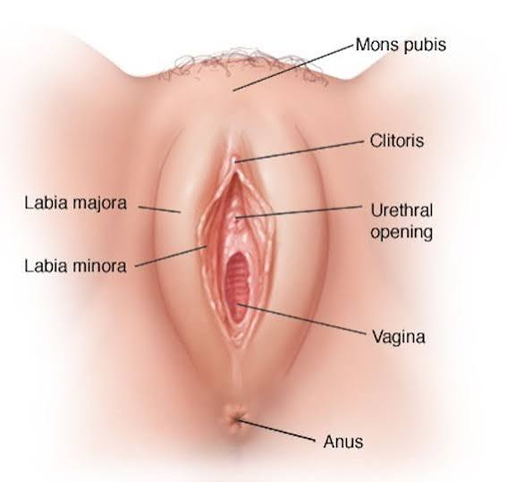

人体器官（Human Body Organs）是英语基础词汇的重要组成部分。  
本表包含**身体部位、内部器官、系统相关词汇**，并列出常见的多义中文。

## 1. 身体基础部位（Basic Body Parts）

| 英语       | 音标         | 多个意思的中文        |
| -------- | ---------- | -------------- |
| body     | /ˈbɑːdi/   | 身体；躯体；主体；物体；团体 |
| head     | /hed/      | 头；负责人；顶部；方向；领导 |
| face     | /feɪs/     | 脸；面孔；表面；面对；处理  |
| hair     | /her/      | 头发；毛发；细微线状物    |
| neck     | /nek/      | 脖子；颈部；连接部分；瓶颈  |
| shoulder | /ˈʃoʊldər/ | 肩膀；肩部；承担责任     |
| arm      | /ɑːrm/     | 手臂；武器；扶手；部门    |
| hand     | /hænd/     | 手；帮助；指针；人手；交付  |
| finger   | /ˈfɪŋɡər/  | 手指；指状物；指向      |
| thumb    | /θʌm/      | 拇指；大拇指；快速浏览    |
| nail     | /neɪl/     | 指甲；钉子；固定       |
| chest    | /tʃest/    | 胸部；胸腔；箱子；柜子    |
| back     | /bæk/      | 背部；后面；支持；返回    |
| waist    | /weɪst/    | 腰；腰部；中间部分      |
| hip      | /hɪp/      | 臀部；髋部；时髦的      |
| butt     | /bʌt/      | 屁股             |
| leg      | /leɡ/      | 腿；支柱；阶段；脚架     |
| knee     | /niː/      | 膝盖；膝部          |
| foot     | /fʊt/      | 脚；英尺；底部；基础     |
| toe      | /toʊ/      | 脚趾；脚尖；末端       |
| skin     | /skɪn/     | 皮肤；外皮；表层；剥皮    |

## 2. 头部器官（Head Organs）

|英语|音标|多个意思的中文|
|---|---|---|
|brain|/breɪn/|大脑；头脑；智力；聪明人|
|eye|/aɪ/|眼睛；视力；眼光；中心|
|ear|/ɪr/|耳朵；听觉；穗（谷物）|
|nose|/noʊz/|鼻子；嗅觉；突出部分；探查|
|mouth|/maʊθ/|嘴；入口；开口；说话方式|
|lip|/lɪp/|嘴唇；边缘；口头表达|
|tooth|/tuːθ/|牙齿；齿状物；尖端|
|teeth|/tiːθ/|牙齿（tooth复数）；齿轮|
|tongue|/tʌŋ/|舌头；语言；口头表达|
|throat|/θroʊt/|喉咙；咽喉；狭窄通道|
|cheek|/tʃiːk/|脸颊；厚脸皮；无礼|
|chin|/tʃɪn/|下巴；聊天（俚语）|

## 3. 内部器官（Internal Organs）

|英语|音标|多个意思的中文|
|---|---|---|
|organ|/ˈɔːrɡən/|器官；机构；风琴；组织|
|heart|/hɑːrt/|心脏；内心；中心；爱情|
|lung|/lʌŋ/|肺；呼吸器官|
|liver|/ˈlɪvər/|肝脏；生活者（live派生）|
|kidney|/ˈkɪdni/|肾脏；肾形物|
|stomach|/ˈstʌmək/|胃；腹部；食欲；忍受力|
|intestine|/ɪnˈtestɪn/|肠；内部结构|
|bowel|/ˈbaʊəl/|肠；内部；排泄系统|
|bladder|/ˈblædər/|膀胱；储存袋|
|pancreas|/ˈpæŋkriəs/|胰腺|
|spleen|/spliːn/|脾脏；怒气（旧义）|
|appendix|/əˈpendɪks/|阑尾；附录；附加物|
|muscle|/ˈmʌsəl/|肌肉；力量；实力|
|bone|/boʊn/|骨头；骨骼；核心；去骨|
|blood|/blʌd/|血液；血统；生命力；亲属|
|vein|/veɪn/|静脉；血管；矿脉；纹理|
|artery|/ˈɑːrtəri/|动脉；主要路线|
|nerve|/nɜːrv/|神经；勇气；胆量|
|cell|/sel/|细胞；小房间；电池单元|
|tissue|/ˈtɪʃuː/|组织；纸巾；织物|

## 4. 感官器官（Sense Organs）

|英语|音标|多个意思的中文|
|---|---|---|
|eye|/aɪ/|眼睛；视觉；观察力|
|ear|/ɪr/|耳朵；听力；听觉能力|
|nose|/noʊz/|鼻子；嗅觉；判断力|
|tongue|/tʌŋ/|舌头；语言；表达能力|
|skin|/skɪn/|皮肤；感觉；外层|

## 5. 生殖系统相关（Reproductive Organs）

| 英语                 | 音标                       | 多个意思的中文   |
| ------------------ | ------------------------ | --------- |
| reproductive organ | /ˌriːprəˈdʌktɪv ˈɔːrɡən/ | 生殖器官      |
| Genitals           | /ˈdʒenɪtlz/              | 生殖器；外阴部   |
| male               | /meɪl/                   | 男性的；雄性；男性 |
| female             | /ˈfiːmeɪl/               | 女性的；雌性；女性 |
| sperm              | /spɜːrm/                 | 精子；精液     |
| egg                | /eɡ/                     | 卵；蛋；鸡蛋；核心 |
| uterus             | /ˈjuːtərəs/              | 子宫        |
| ovary              | /ˈoʊvəri/                | 卵巢        |
| breast             | /brest/                  | 乳房；胸部；胸肉  |
| mons pubis         | /mɒnz ˈpjuːbɪs/          | 阴阜        |
| vulva              | /ˈvʌlvə/                 | 外阴（整个阴部）  |
| Vagina             | /vəˈdʒaɪnə/              | 阴道；叶鞘，鞘   |
| vaginal opening    | /vəˈdʒaɪnl ˈəʊpənɪŋ/     | 阴道口       |
| Clitoris           | /ˈklɪtərɪs/              | 阴蒂；阴核     |
| Labia              | /ˈleɪbiə/                | 阴唇；唇      |
| Labia majora       | /ˈleɪbiə /               | 大阴唇       |
| Labia minora       | /ˈleɪbiə /               | 小阴唇       |
| Urethra            | /jʊˈriːθrə/              | 尿道        |
| Urethral opening   | /jʊˈriːθrəl ˈəʊpənɪŋ/    | 尿道口       |
| pussy              | /ˈpʊsi/                  | 女阴，性交；    |
| Perineum           | /ˌperɪˈniːəm/            | 会阴        |
| anus               | /ˈeɪnəs/                 | 肛门；屁眼     |




## 6. 运动系统（Movement System）

| 英语       | 音标          | 多个意思的中文    |
| -------- | ----------- | ---------- |
| skeleton | /ˈskelɪtən/ | 骨骼；框架；骨架   |
| bone     | /boʊn/      | 骨头；骨质；核心   |
| muscle   | /ˈmʌsəl/    | 肌肉；力量；实力   |
| joint    | /dʒɔɪnt/    | 关节；连接处；共同的 |
| shoulder | /ˈʃoʊldər/  | 肩膀；承担      |
| elbow    | /ˈelboʊ/    | 手肘；弯曲处     |
| wrist    | /rɪst/      | 手腕；腕部      |
| knee     | /niː/       | 膝盖         |
| ankle    | /ˈæŋkəl/    | 脚踝；踝关节     |

## 7. 口腔相关（Mouth & Teeth）

|英语|音标|多个意思的中文|
|---|---|---|
|mouth|/maʊθ/|嘴；入口；开口|
|tooth|/tuːθ/|牙齿；齿状物|
|teeth|/tiːθ/|牙齿；齿轮|
|gum|/ɡʌm/|牙龈；口香糖；胶|
|tongue|/tʌŋ/|舌头；语言|
|jaw|/dʒɔː/|下巴；颌；夹紧装置|
|throat|/θroʊt/|喉咙；通道|

## 8. 医疗相关身体词汇（Medical Body Words）

|英语|音标|多个意思的中文|
|---|---|---|
|health|/helθ/|健康；状态；健康状况|
|disease|/dɪˈziːz/|疾病；弊病|
|illness|/ˈɪlnəs/|疾病；不健康状态|
|pain|/peɪn/|疼痛；痛苦；努力|
|fever|/ˈfiːvər/|发烧；热情；狂热|
|wound|/wuːnd/|伤口；创伤；伤害|
|injury|/ˈɪndʒəri/|受伤；损害|
|medicine|/ˈmedɪsɪn/|药；医学；治疗方法|
|treatment|/ˈtriːtmənt/|治疗；处理；对待|
|surgery|/ˈsɜːrdʒəri/|手术；外科；外科医学|
 
## ⭐ 初学者人体器官核心词汇

```text
body       身体
head       头
face       脸
hair       头发
eye        眼睛
ear        耳朵
nose       鼻子
mouth      嘴
tooth      牙齿
tongue     舌头

neck       脖子
shoulder   肩膀
arm        手臂
hand       手
finger     手指

chest      胸部
heart      心脏
lung       肺
liver      肝脏
kidney     肾脏
stomach    胃

blood      血液
bone       骨头
muscle     肌肉
skin       皮肤
brain      大脑

leg        腿
knee       膝盖
foot       脚
toe        脚趾
```